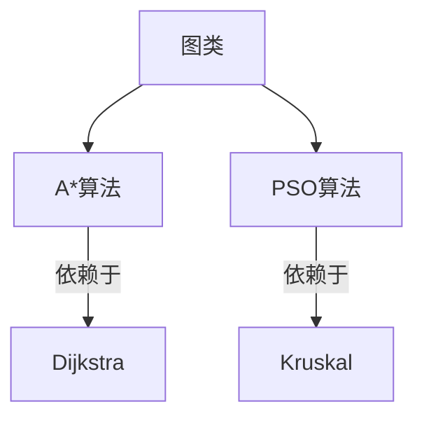

# 自动布线算法

## 用于毕业设计

## 各模块划分
1. 随机图生成模块
2. 测试模块
3. 日志模块
3. 主程序模块

### log 模块
    部分参考
    https://www.cnblogs.com/oftenlin/p/9477947.html

### pso算法
    此处代码实现参考
    https://blog.csdn.net/daaikuaichuan/article/details/81382794
